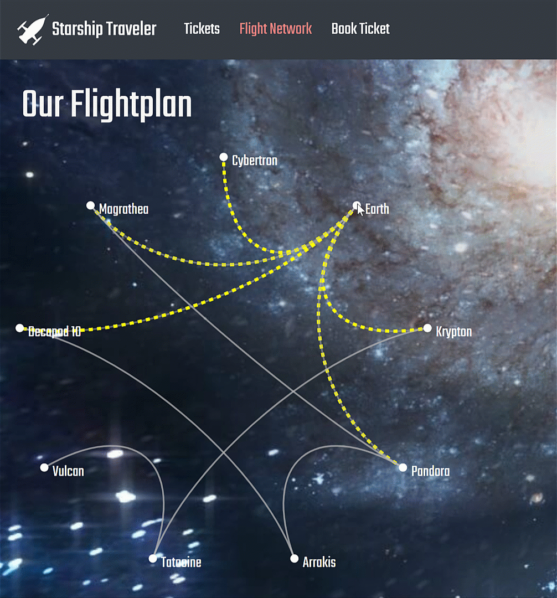
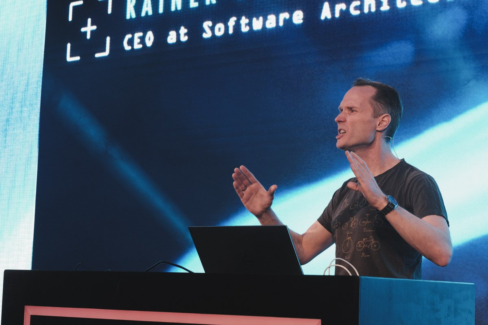

# Starship Traveler Blazor Demo

I created this demo app for the [DevOne 2019 conference](https://devone.at). It has been updated for my Blazor sessions at [Techorama Belgium 2019](https://techorama.be/) and [.NET Day Switzerland](https://dotnetday.ch/). It showcases the capabilities of the ASP.NET Core Blazor framework.

**Note** that this sample will not be continuously maintained. I will update it every now and then whenever I use it in workshops and/or conference talks. If you update and/or extend it, feel free to send me a pull request.

## Run the Full Demo

* [Install *Blazor*](https://docs.microsoft.com/en-us/aspnet/core/client-side/spa/blazor/get-started) and its requirements.

* Clone the repository.

* Open the solution [StarshipTraveler.sln](StarshipTraveler.sln) and run it.

## Replay Demo?

Do you want to try the demo yourself? Here is what you do:

* [Install *Blazor*](https://docs.microsoft.com/en-us/aspnet/core/client-side/spa/blazor/get-started) and its requirements.

* Clone the repository.

* Open the solution in the [*Start*](Start) folder.

* Follow the steps mentioned in [*storyboard.md*](storyboard.md). You will find the files referenced there in the [*Assets*](Assets) folder.

## Recording

Recording of the session at DevOne Linz in Spring 2019:
https://www.youtube.com/watch?v=_gYgkZ1UBQ4
